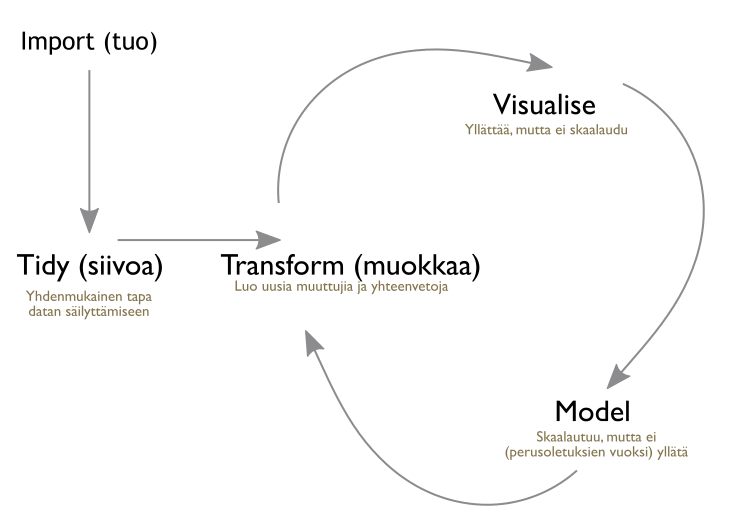

# Ennakkotehtävät


## Lue


## Katso

- [Open research methods in computational social sciences and humanities: introducing R (Kainu 2014)](https://digihist.se/5-metoder-inom-digital-historia/fordjupning-open-research-methods-in-computational-social-sciences-and-humanities-introducing-r/)


# Kurssilla käytettävä R-kielen murre eli ns. "Hadleyverse"





# Kurssin rakenne


## Import / tuo


R:n perusasennuksessa tulee [joukko datoja](https://stat.ethz.ch/R-manual/R-devel/library/datasets/html/00Index.html) mukana, jotka ovat heti käytettävissä. Saat datan kuvauksen kirjoittamalla `?datan_nimi`. Aluksi käytämme dataa `?mtcars`.

```{r kuvaamtcars}
?mtcars
head(mtcars)
```

Samat datat + paljon muuta löytyy Vincent ylläpitämältä [Rdatasets](https://vincentarelbundock.github.io/Rdatasets/datasets.html)-sivustolta, josta voimme ladata esimerkiksi saman `mtcars`-datan komennolla 

```{r lataamtcars}
d <- read.csv("https://vincentarelbundock.github.io/Rdatasets/csv/datasets/mtcars.csv",
                   stringsAsFactors = FALSE)
head(d)
```


